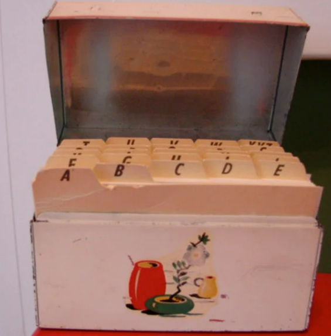

# CSE 180 Prove 01

(c) BYU-Idaho - It is an honor code violation to post this
file completed or uncompleted in a public file sharing site.

**Instructions**: Answer each question using proper markdown notation as needed.  Use the preview view in Visual Studio Code (or other editor you may be using) to see the formatting, tables, and mathematical formulae.  If you need to write code, first test in a separate file and then copy the code into this document using code fences.  Submit the markdown file (not a pdf) into I-Learn.

## Question 1

What is the maximum number of steps (worst case) to find something in a sorted list of 1 million items using linear search?

Answer: 

## Question 2

What is the maximum number of steps (worst case) to find something in a sorted list of 1 million items using binary search?

Answer: 

## Question 3

What is the maximum number of steps (worst case) find something in a sorted list of 1 trillion items using binary search?

Answer: 

## Question 4

The best case for doing a binary search is actually only 1 step.  If you had 1 trillion items in your sorted list, describe the scenario that would only take 1 step to find something.

Answer:

## Question 5

Imagine also that you have a physical recipe box (see picture below) with index tab cards that are labeled with the letters of the alphabet (e.g. A, B, C, D, ...).  As an organized cook, you then put all all the cards into the proper place in the recipe box according to the index tab cards.  All the recipe cards that start with the letter `A` are sorted behind the `A` tab.  Likewise, all the recipe cards that start with the letter `B` are sorted behind the `B` tab.  All the cards (except the tabbed cards) are then numbered 0, 1, 2, 3, etc.  What are the discrete steps (in words, not code) for an algorithm based on the binary search algorithm to find a recipe in the box?

Answer: 
1. Describe step 1
2. Describe step 2
3. Describe step 3

(add more steps as needed)