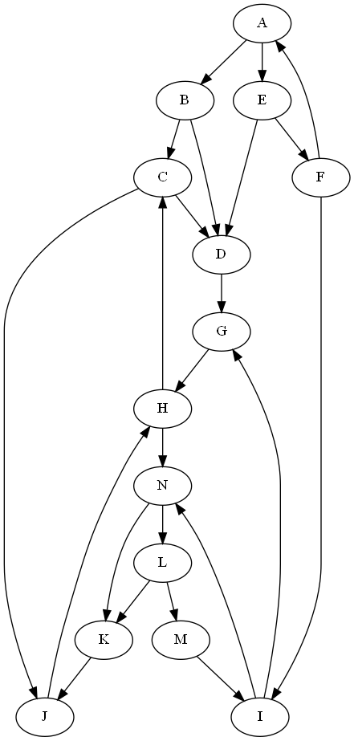

# CSE 180 Prove 06

(c) BYU-Idaho - It is an honor code violation to post this
file completed or uncompleted in a public file sharing site.

**Instructions**: Answer each question using proper markdown notation as needed.  Use the preview view in Visual Studio Code (or other editor you may be using) to see the formatting, tables, and mathematical formula.  If you need to write code, first test in a separate file and then copy the code into this document using code fences.  Submit the markdown file (not a pdf) into I-Learn.


## Question 1

Consider the following graph:



How many verticies/nodes are in the graph?

**Answer**: 

## Question 2

How many edges are in the graph shown in Question 1?

**Answer**: 

## Question 3

Using the same graph from Problem 1, find the length of the shortest path from the start node to end node in the table below.  If there is no path, then indicate "NONE".

|Starting Vertex/Node|Ending Vertex/Node|Length of Shortest Path
|:-:|:-:|:-:|
|A|G||
|A|H||
|C|F||
|F|C||
|I|J||
|A|J||
|E|K||
|F|G||
|G|F||
|E|B||
|B|E||

## Question 4

Explain why the performance of the Breadth-First algorithm is O(V+E).

**Answer**: 

## Question 5 (Worth 10% Bonus)

Using the `breadth_first_search` function implemented below, write code to verify your answers to Question 3.

```python
from collections import deque

def breadth_first_search(graph, start, end):
    already_visited = set()
    queue = deque()
    queue.append((start,0,start))  # (node, distance, path)

    while len(queue) > 0:
        (curr,distance,path) = queue.popleft()
        if curr == end:
            return (distance,path)
        if curr not in already_visited:
            already_visited.add(curr)
            for node in graph[curr]:
                queue.append((node,distance+1,path+","+node))
    return (-1,"")

# Add your code here 
```

