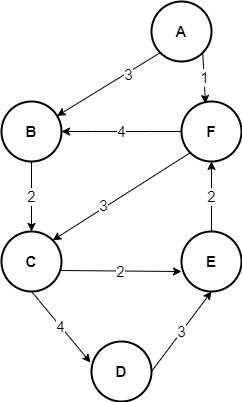
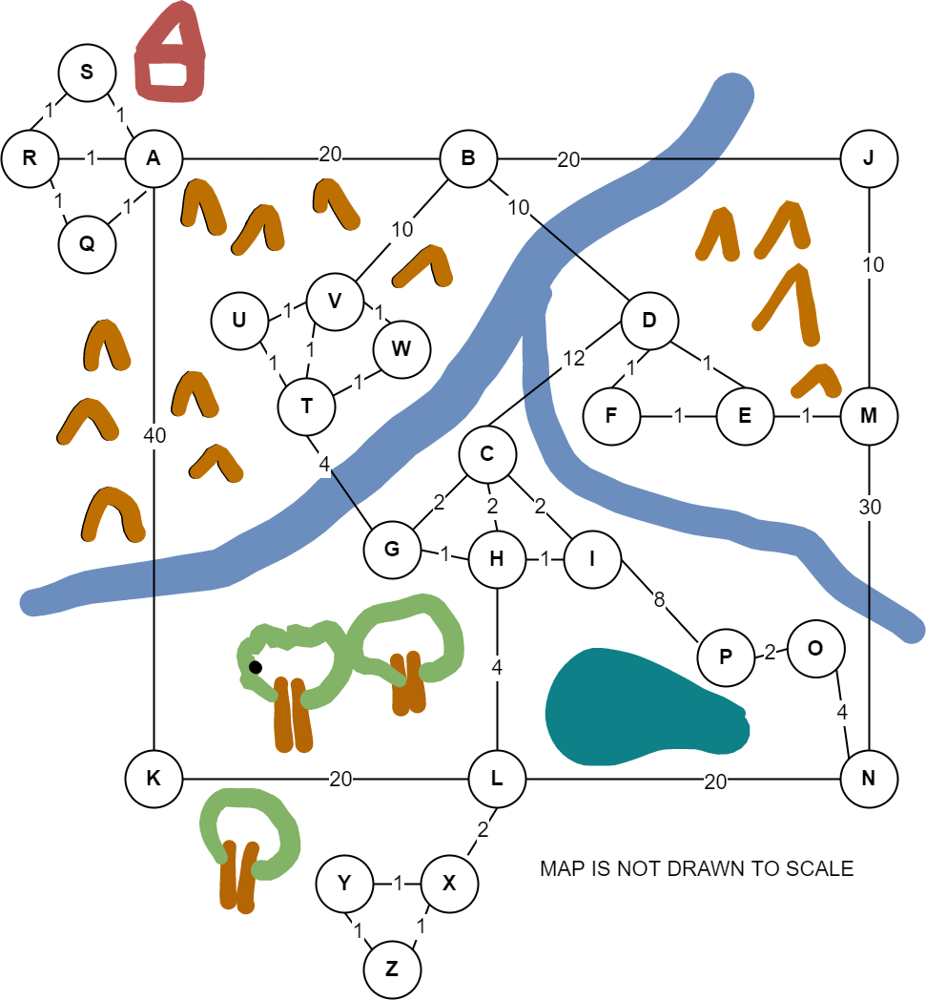

# CSE 180 Prove 07

(c) BYU-Idaho - It is an honor code violation to post this
file completed or uncompleted in a public file sharing site.

**Instructions**: Answer each question using proper markdown notation as needed.  Use the preview view in Visual Studio Code (or other editor you may be using) to see the formatting, tables, and mathematical formula.  If you need to write code, first test in a separate file and then copy the code into this document using code fences.  Submit the markdown file (not a pdf) into I-Learn.


## Question 1

Consider the following directed weighted graph.  Find the shortest path starting at A going to each of the other nodes using Dijkstra's algorithm.  List the path and the distance. The first one is done for you.



|Ending Node|Path|Distance|
|:-:|:-:|:-:|
|B|A->B|3|
|C|||
|D|||
|E|||
|F|||

## Question 2

Consider the following undirected weighted graph that represents a road network.  Assume that you live at node S.  Find the shortest distance to travel to all other nodes using Dijkstra's algorithm.



|Ending Node|Distance|
|:-:|:-:|
|A||
|B||
|C||
|D||
|E||
|F||
|G||
|H||
|I||
|J||
|K||
|L||
|M||
|N||
|O||
|P||
|Q||
|R||
|S|0|
|T||
|U||
|V||
|W||
|X||
|Y||
|Z||

## Question 3 (Worth 10% Bonus)

Modify the starting code below which implements Dijkstra's algorithm to verify your answers to question 2.  What nodes should be traversed to follow the shortest route between nodes S and N?

**Answer**: 

```python
INFINITY = float("inf")

def init_tables(graph):
    costs = {}
    parents = {}
    for node in graph.keys():
        costs[node] = INFINITY
        parents[node] = None
    return costs, parents

def find_lowest_cost_node(costs, processed):
    # Note that this is a poor performing algorithm.  Searching for
    # a node with the lowest priority can be done with a priority 
    # queue ... but we haven't learned about those yet.
    lowest = INFINITY
    lowest_node = None
    for node, value in costs.items():
        if node not in processed:
            if value < lowest:
                lowest = value;
                lowest_node = node;
    return lowest_node
           
def get_shortest_path(graph, start):
    # Initialize our costs and parents helper tables
    costs, parents = init_tables(graph)

    # We will use a set to keep track of nodes we have processed
    # so we don't repeat any.
    processed = set()

    # Start the costs table by setting the cost for getting to the 
    # starting node (which is just 0 because you are already there)
    costs[start] = 0

    # Visit all the nodes until there are no mode nodes to visit
    curr_node = start 
    while curr_node is not None:

        # If getting to each neighbor node is faster via our 
        # current node, then lets update the neighbor to go through
        # the current node.  
        for neighbor, neighbor_cost in graph[curr_node].items():
            new_cost = costs[curr_node] + neighbor_cost

            # Note that if costs[neighbor] hasn't been visited yet
            # then it will be equal to INFINITY in which this 
            # condition check will always be True.
            if new_cost < costs[neighbor]:
                costs[neighbor] = new_cost
                parents[neighbor] = curr_node

        # Done processing this node ... add it to the set to avoid 
        # processing it again.
        processed.add(curr_node)

        # Find the next next node to visit (that we haven't processed yet)
        # by finding the node that has the current lowest cost to 
        # arrive at (via our original start).
        curr_node = find_lowest_cost_node(costs, processed)

    return costs, parents


```

